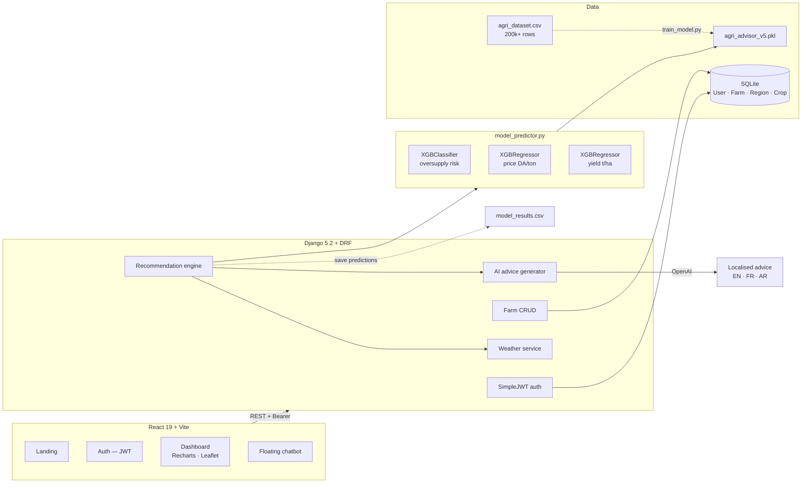

<div align="center">


# 🌾 AgroVisor Algeria

### AI crop advisory for Algerian farmers — in Arabic, French, and English

*Three XGBoost models turn a farm's region, soil, and season into a price forecast, a yield estimate, and an oversupply risk score — then rank which crops are actually worth planting.*

<br/>

[](https://djangoproject.com)
[](https://django-rest-framework.org)
[](https://xgboost.ai)
[](https://react.dev)
[](https://tailwindcss.com)
[](https://leafletjs.com)

[](https://test-alg2-0.vercel.app)
[](#-machine-learning)
[](#-machine-learning)
[-success?style=flat-square)](#-internationalisation)

<br/>


</div>

---

## The problem

An Algerian smallholder decides what to plant with three unknowns: what the crop will sell for at harvest, how much land will actually yield, and whether every other farm in the wilaya is planting the same thing. Get the third one wrong and a good harvest becomes a price collapse.

AgroVisor makes all three predictable. A farmer registers a farm — location, size, soil type — and gets a ranked list of crops with a forecast price in DA/kg, an expected yield in tons/ha, and an oversupply risk percentage, plus contextual advice generated in their own language.

---

## Why this project is worth a look

| | |
|---|---|
| **Three models, one decision** | Risk classification, price regression, and yield regression are trained separately and combined into a single recommendation score with a risk threshold — not one model asked to do everything |
| **Genuine RTL support** | Full Arabic localisation with right-to-left layout, including translated region names, crop names, and soil types — not just a string file swap |
| **Region-aware defaults** | Soil type auto-detects from wilaya via `region_soil_mapping.csv`, so a farmer who doesn't know their soil classification can still get a recommendation |
| **The feedback loop is built in** | Predictions are written back to `model_results.csv` with duplicate prevention, creating a retraining corpus from real usage |
| **LLM as a layer, not the product** | OpenAI generates the human-readable advice *around* the model output. The numbers come from XGBoost, not from a language model |

---

## 🏗️ Architecture



---

## 🤖 Machine learning

Three XGBoost models share one feature set and one preprocessing pipeline, persisted together as `agri_advisor_v5.pkl`.

| Model | Type | Output | Used for |
|---|---|---|---|
| Risk classifier | `XGBClassifier` | Oversupply risk, 0–100 % | Filtering crops above the risk threshold |
| Price regressor | `XGBRegressor` | DA/ton → converted to DA/kg | Revenue projection |
| Yield regressor | `XGBRegressor` | tons/ha | Production planning |

<details open>
<summary><b>Feature set</b></summary>

<br/>

| Feature | Type | Source |
|---|---|---|
| Region (wilaya) | Categorical | Farm profile |
| Soil type | Categorical | Farm profile, auto-detected from region |
| Crop | Categorical | Candidate crop |
| Month | Numeric | Planting / harvest window |
| Year | Numeric | Season |
| Planted area | Numeric, ha | Farm profile |
| Temperature | Numeric, °C | Weather service |
| Rainfall | Numeric, mm | Weather service |

</details>

<details>
<summary><b>Retraining</b></summary>

```bash
cd backend
python train_model.py
```

Loads `backend/data/agri_dataset.csv`, encodes and scales features, trains all three models, and writes `backend/models/agri_advisor_v5.pkl`.

Retrain whenever new rows land in `agri_dataset.csv` — including the rows the app itself writes back from live predictions.

> 📌 **Add your evaluation numbers here.** A short table with risk classifier accuracy/F1 and price/yield RMSE or MAE would make this section considerably stronger for a technical reader.

</details>

---

## ✨ Features

<details open>
<summary><b>Advisory core</b></summary>

<br/>

- **Crop recommendations** ranked from farm conditions, soil, weather, and market data
- **Price forecasting** in DA/kg
- **Yield forecasting** in tons/ha
- **Oversupply risk scoring** with a threshold that filters recommendations rather than just displaying a number
- **Intended-crop analysis** — a farmer's own plan is evaluated and returned with a confidence level and specific advice

</details>

<details>
<summary><b>Farm management and UI</b></summary>

<br/>

- Multiple farms per account, with update-in-place when name, location, and owner match
- Automatic soil-type detection from region
- Leaflet map with farm location and OpenStreetMap geocoding
- Recharts pie and bar charts for crop scores and prices
- Framer Motion transitions, mobile-first Tailwind layout
- Prediction export to CSV with duplicate prevention

</details>

---

## 🌍 Internationalisation

| Language | Layout | Coverage |
|---|---|---|
| English | LTR | Full UI, regions, crops, soil types |
| Français | LTR | Full UI, regions, crops, soil types |
| العربية | **RTL** | Full UI, regions, crops, soil types |

Translations live in `frontend/src/contexts/LanguageContext.jsx`. The `lang` query parameter is passed through to the recommendation endpoint so that AI-generated advice comes back in the same language as the interface.

---

## 🔌 API

<details open>
<summary><b>Authentication</b></summary>

| Method | Endpoint | Body / Headers |
|---|---|---|
| `POST` | `/api/auth/register/` | `{ email, password, first_name, last_name }` |
| `POST` | `/api/auth/login/` | `{ email, password }` → access + refresh tokens |
| `GET` | `/api/auth/profile/` | `Authorization: Bearer <token>` |

</details>

<details open>
<summary><b>Farms and recommendations</b></summary>

| Method | Endpoint | Notes |
|---|---|---|
| `GET` | `/api/farms/` | List the authenticated user's farms |
| `POST` | `/api/farms/` | `{ name, location, size_hectares, soil_type, intended_crop }` |
| `GET` | `/api/farms/{id}/` | Farm detail |
| `PUT` | `/api/farms/{id}/` | Update in place |
| `GET` | `/api/recommendations/{farm_id}/?lang={en\|fr\|ar}` | Ranked crops + intended-crop analysis |
| `GET` | `/api/regions/` | Regions with coordinates |
| `GET` | `/api/crops/` | Crop catalogue |
| `POST` | `/api/save-model-result/{farm_id}/` | Persist a prediction for retraining |

</details>

<details>
<summary><b>Sample recommendation response</b></summary>

```json
{
  "recommendations": [ "..." ],
  "intended_crop_analysis": {
    "crop_name": "Wheat",
    "is_recommended": true,
    "confidence": "high",
    "recommendation": "...",
    "advice": [ "..." ],
    "details": {
      "price_forecast": 123.45,
      "yield_per_ha": 5.67,
      "oversupply_risk": 12.3
    }
  }
}
```

</details>

---

## 🚀 Installation

<details open>
<summary><b>Backend</b></summary>

```bash
git clone https://github.com/ZakiANK04/AgroVisor---Algeria-2.0.git
cd AgroVisor---Algeria-2.0/backend

python -m venv venv
source venv/bin/activate          # Windows: venv\Scripts\activate

pip install -r requirements.txt
python manage.py migrate
python manage.py update_from_csv   # seeds regions + crops
python train_model.py              # trains and saves agri_advisor_v5.pkl
python manage.py runserver
```

</details>

<details open>
<summary><b>Frontend</b></summary>

```bash
cd ../frontend
npm install
npm run dev        # http://localhost:5173
```

</details>

<details>
<summary><b>Environment variables</b></summary>

<br/>

Create `backend/.env`:

| Variable | Required | Purpose |
|---|---|---|
| `OPENAI_API_KEY` | For AI advice | Contextual advice generation |
| `WEATHER_API_KEY` | For live weather | Temperature and rainfall features |
| `SECRET_KEY` | Production | Django secret |
| `DEBUG` | Production | Set `False` |

And `frontend/.env`:

| Variable | Purpose |
|---|---|
| `VITE_API_URL` | Backend base URL |

> ⚠️ **A `.env` file is currently committed under `frontend/`.** Remove it from the repository, add `.env` to `.gitignore`, and rotate anything it contained.

</details>

---

## 📁 Structure

```
AgroVisor---Algeria-2.0/
├── backend/
│   ├── api/
│   │   ├── models.py                    # User · Farm · Region · Crop
│   │   ├── views.py  serializers.py  urls.py
│   │   ├── services/
│   │   │   ├── model_predictor.py       # Model loading + prediction
│   │   │   ├── recommendation.py        # Ranking + risk threshold
│   │   │   ├── ai_advice_generator.py   # OpenAI layer
│   │   │   └── weather_api.py
│   │   └── management/commands/         # update_from_csv · seed_regions · seed_data
│   ├── core/settings.py
│   ├── data/
│   │   ├── agri_dataset.csv             # 200k+ training rows
│   │   └── region_soil_mapping.csv
│   ├── models/agri_advisor_v5.pkl
│   └── train_model.py
├── frontend/
│   └── src/
│       ├── pages/                       # Landing · Login · Signup · Dashboard
│       ├── components/                  # FarmForm · FarmMap · FloatingChatbot · Toast
│       └── contexts/                    # AuthContext · LanguageContext
└── data/model_results.csv               # Predictions saved for retraining
```

---

## ⚠️ Limitations

<details>
<summary><b>What would need to change for production</b></summary>

<br/>

- **SQLite** is the default database — fine for a demo, needs PostgreSQL for concurrent writes.
- **Oversupply risk is derived from a binary classifier's probability**, presented as a percentage. That's a reasonable proxy, but it is not a calibrated market-saturation estimate.
- **Weather features come from an API at request time** while the model was trained on historical values — worth checking that the distributions match.
- **No model versioning.** `agri_advisor_v5.pkl` is overwritten on retrain, so a bad training run is not recoverable.

</details>

---

## 🛠️ Stack

**Backend** · Django 5.2 · Django REST Framework · SimpleJWT · django-cors-headers · SQLite · XGBoost · scikit-learn · pandas · joblib · OpenAI · python-dotenv
**Frontend** · React 19 · Vite · Tailwind CSS 4 · Recharts · Leaflet + react-leaflet · React Router 7 · Axios · Framer Motion · Context API

---

<div align="center">

**Ahcene Zakaria Aouanouk** — Data Science & AI student, Algiers

[](https://www.linkedin.com/in/ahcene-zakaria-aouanouk-1126902b7/)
[](mailto:zzaouanouk@gmail.com)

</div>
